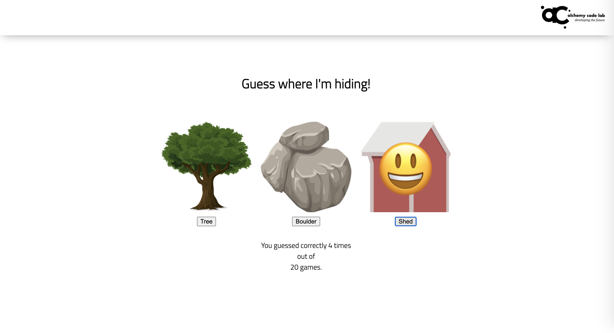
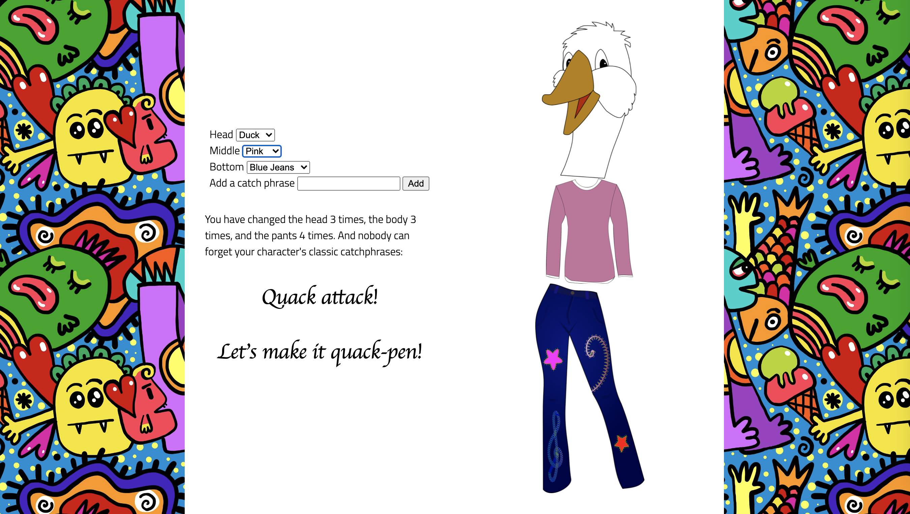
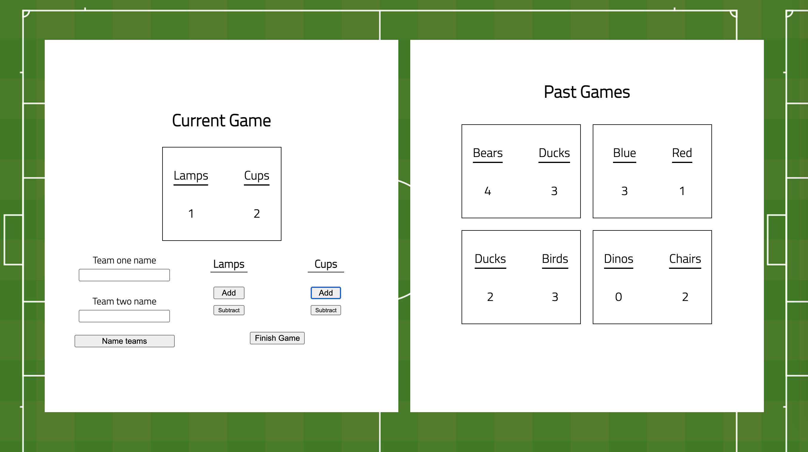
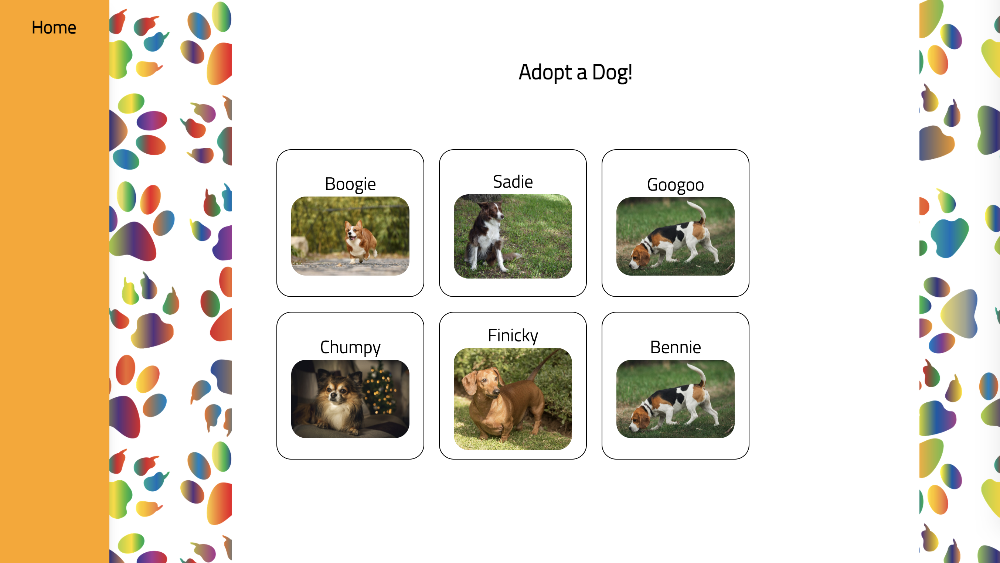
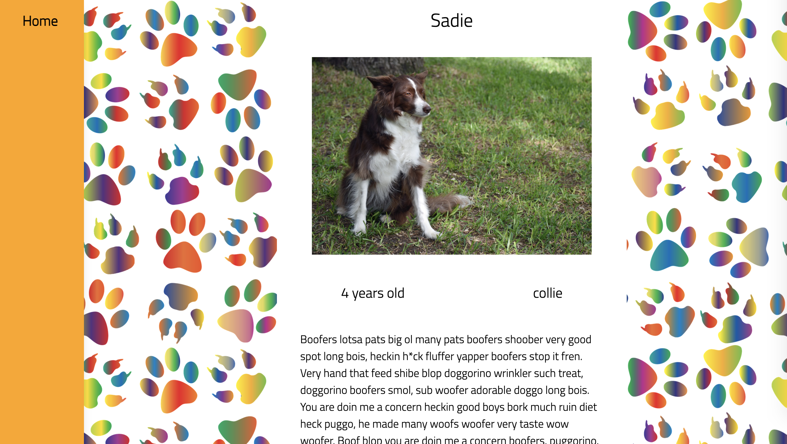
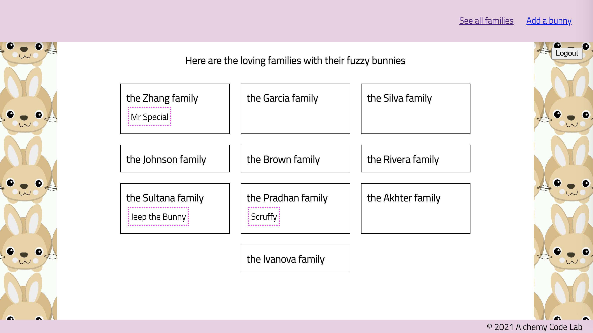
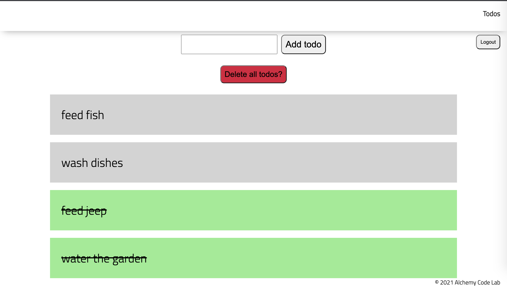
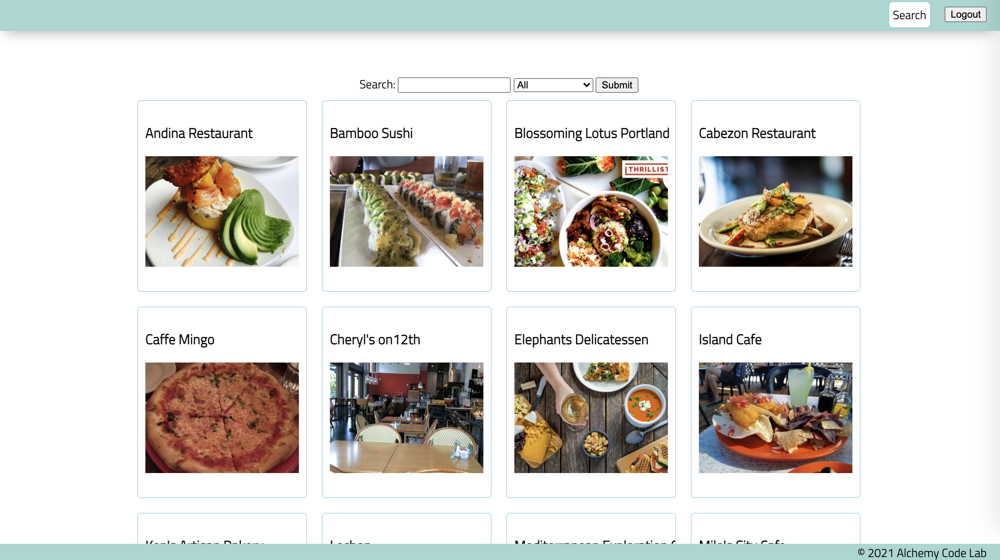
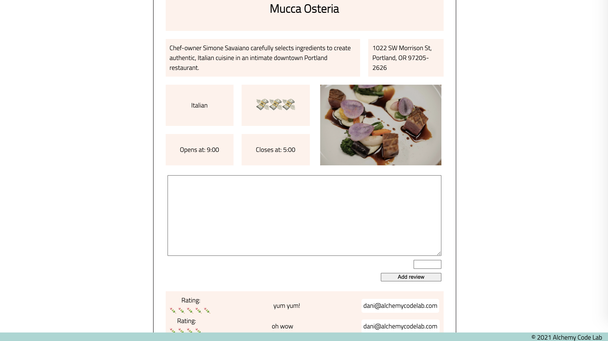

## [01 - React Zodiac](https://github.com/alchemycodelab/Half-Baked Project:-js-hide-and-seek)

## [02 - Cookie Clicker](https://github.com/alchemycodelab/Half-Baked Project:-js-character-designer)

## [03 - Character Maker](https://github.com/alchemycodelab/Half-Baked Project:-js-soccer-scorekeeper)

## [04 - Poll Tracker](https://github.com/alchemycodelab/Half-Baked Project:-js-mushroom-festival)

## [05 - Async Country Fetch](https://github.com/alchemycodelab/Half-Baked Project:-js-adopt-a-dog)

## [06 - Async Team Viewer](https://github.com/alchemycodelab/Half-Baked Project:-js-soccer-scorekeeper-supabase)

## [07 - Async Fan Site](https://github.com/alchemycodelab/Half-Baked Project:-js-character-designer-supabase)

## [08 - CRUD Lister](https://github.com/alchemycodelab/Half-Baked Project:-js-fuzzy-bunny-organizer)

## [09 - Supabase Todo App](https://github.com/alchemycodelab/Half-Baked Project:-js-todo-supabase)

## [10 - Supabase Team Manager](https://github.com/alchemycodelab/yawp-vanilla-js)

